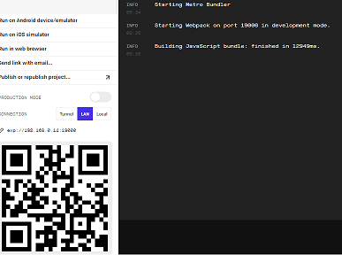

# Criando interface do iFood com React Native

### Instalando o expo
npm install --global expo-cli

## Criando o projeto

expo init ifood

### Instalando o yarn
npm install --global yarn

## Instalando as bibliotecas:

yarn add styled-components

yarn add @react-navigation/native

yarn add @react-navigation/native-stack

yarn add @react-navigation/bottom-tabs

### Instalando dependências dentro do Expo, se estiver usando o expo 

expo install react-native-screens react-native-safe-area-context

### Instalando dependências dentro do React Native sem o uso do Expo. 

yarn add react-native-screens react-native-safe-area-context

### Rodar o aplicativo

expo start

  

## Links Úteis:

https://expo.dev/

https://styled-components.com/

https://reactnavigation.org/

